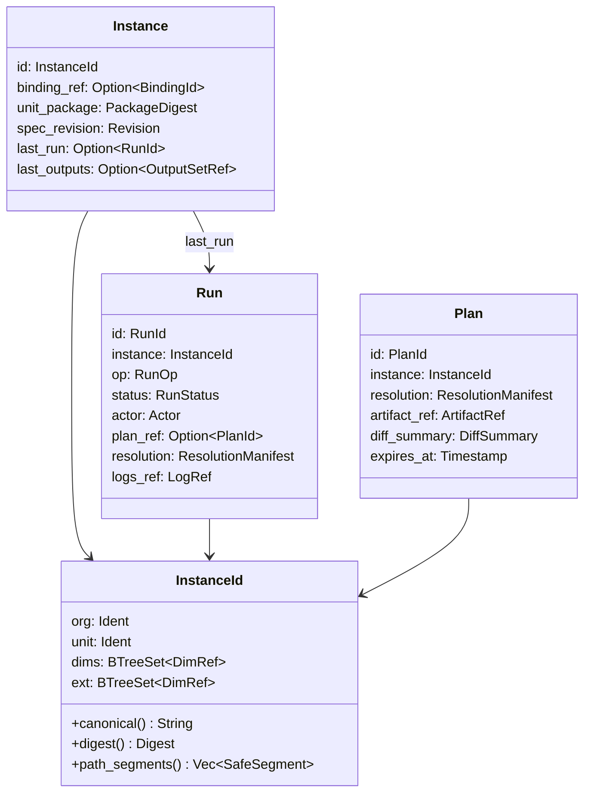
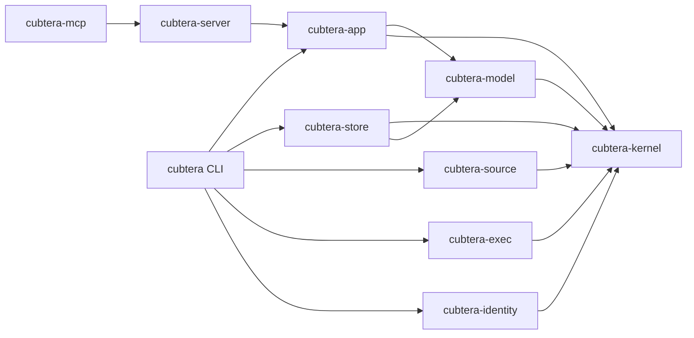

# Cubtera v3: Instance-Centric Architecture

Status: approved, in implementation. Companion to the plan
`.cursor/plans/cubtera_v3_architecture_5c276e64.plan.md` (not modified by this
document - this spec is the detailed, versioned record; the plan file tracks
phase-level todo status).

## 0. Why

v2 (`v1/` -> hexagonal rewrite, this repo's current `main`/`v2-rewrite`) fixed
the architecture's *shape* (ports/adapters, `AppError` at the edges, pure
domain functions) but kept the *model* of v1: a unit is multiplexed over a
command string (`cubtera run -u X -d type:name -- terraform apply`), and
nothing durable exists between invocations except best-effort side files
(a JSONL deployment log, a JSON blob per state-mesh key). A prior review of
this codebase (`architecture-review.canvas.tsx` review session) found:

- path-escape into arbitrary host directories via unvalidated dimension/
  extension/org/unit strings (critical),
- an access-policy bypass via undeclared dimensions unioned into the
  ancestor set before `AccessPolicy::evaluate` (critical),
- org-specific unit overriding silently dead (`materialize(..., None)`
  always, `FsUnitRepository` ignores `org`),
- OpenTofu accepting backend/version config and silently ignoring it,
- Mongo inventory dropping `includes`, no unique indexes, key-collision
  prone canonical keys,
- best-effort, unordered, non-transactional state publish with no schema/
  version contract,
- no `Plan` artifact - `apply` cannot be gated on a previously reviewed
  plan; no way to answer "what *should* be running" (desired state) versus
  "what did the last run do".

All of these are symptoms of one missing concept: **there is no first-class,
addressable "this unit, resolved against this exact set of dimensions"
entity that persists across invocations.** v3 introduces it (`Instance`) and
rebuilds everything else - inventory, execution, state exchange, API - around
it.

## 1. Scope of breaking changes

Everything breaks except the inventory on-disk naming convention
(`{type}/{name}.json`, `.default`/`.schema` records, includes, gap-fill
semantics - see `AGENTS.md` "Inventory on-disk format"). Specifically:

- `manifest.toml` -> `unit.toml` (new schema, see ยง6).
- `config.toml` gets new top-level tables (`[store]`, `[identity]`,
  no `[deploymentLog]`/`[unitState]`/Mongo tables).
- CLI: new verbs (`validate`, `fleet`, `plan`, `apply --plan`, `drift`,
  `explain`, `migrate`), old `run` becomes a thin wrapper around
  `plan` + `apply`.
- REST API: new resource model (`Instance`, `Plan`, `Run`), old
  `/v1/{org}/dlog` and `/v1/{org}/units/{name}/state` endpoints are
  superseded by `/v1/{org}/instances/*`.
- MCP: tools call the new HTTP API instead of constructing an `App`
  in-process.
- MongoDB support is removed entirely (no adapter, no `CUBTERA_DB`, no
  `im sync*`).

`cubtera migrate` (ยง10) automates the mechanical parts of the manifest/config
migration for existing installs.

## 2. Core concept: `Instance`

An `Instance` is the tuple `(org, unit, resolved required dimensions,
resolved extensions)`. It is the single addressable thing the rest of the
system is built around:



Every path, lock key, state-mesh key, and log correlation id is *derived
from* `InstanceId`, never independently constructed. This is the single
change that retires the largest cluster of v2 bugs (key collisions, order-
dependent paths vs. sorted state keys, path escape).

## 3. Crate map



| Crate | Depends on | Owns | Zero-I/O? |
|---|---|---|---|
| `cubtera-kernel` | nothing | `Ident`, `SafeSegment`, `DimRef`, `UnitRef`, `InstanceId`, `Digest`/hashing, base `KernelError` | yes |
| `cubtera-model` | kernel | inventory graph (`DimType`, `Dimension`, gap-fill+provenance), `UnitPackage`, `Manifest` v3, `Binding`, `Plan`/`Run`/`OutputSet` value types, `AccessPolicy`/policy engine, `MaterializationPlan` | yes |
| `cubtera-app` | model, kernel | use cases (`resolve`, `validate`, `plan`, `apply`, `fleet_status`, `drift`, `explain`) + all ports (`Store`, `SourceRepo`, `Executor`, `IdentityProvider`, `Clock`) | no (orchestration only, all I/O behind ports) |
| `cubtera-store` | kernel, model | `Store` port + `SqliteStore` (default) - instances, runs, plans, output sets, leases, content-addressed artifact blobs | adapter |
| `cubtera-source` | kernel | `SourceRepo` port + `GitSource` (shells to `git`, pins by commit) + `FsSource` (content-hash snapshot, no history) | adapter |
| `cubtera-exec` | kernel, model | `Workspace` (rooted handle), `ProcessRunner`, `RunnerStrategy` capability contract, `TfLikeRunner` (tf/tofu unified), `BashRunner`, `HelmRunner` | adapter |
| `cubtera-identity` | kernel | credential/identity providers, `$secret` reference resolution, redaction | adapter |
| `cubtera-server` | app | Axum HTTP API, authn/authz, log streaming | interface |
| `cubtera` (CLI) | app, store, source, exec, identity | thin command layer; embeds `cubtera-app` in-process by default, or talks to a remote `cubtera-server` with `--server-url` | interface |
| `cubtera-mcp` | server (as HTTP client) | MCP tools, each a thin call to the HTTP API | interface |

Existing v2 crates (`cubtera-domain`, `cubtera-core`, `cubtera-config`,
`cubtera-persistence`, `cubtera-runners`, `cubtera-api`) are retired
crate-by-crate as each phase lands; see ยง9 (Migration/Removal Plan) for the
exact retirement order. `cubtera-config` survives longest (renamed/absorbed
into `cubtera-app`'s config loader) since every phase needs config parsing.

## 4. `cubtera-kernel`: identity, once

```rust
/// A single path-segment-safe, case-normalized identifier. The only way to
/// get one is `Ident::parse`, which is the sole place raw strings from CLI
/// args, manifests, or HTTP bodies are allowed to become identity.
pub struct Ident(String);

impl Ident {
    /// Rejects: empty, `.`/`..`, `/`, `\`, NUL, leading `.`/`#`, anything
    /// outside `[a-z0-9][a-z0-9_-]*` after lowercasing. Same grammar for
    /// org/unit/dim-type/dim-name/extension-type/extension-name/alias.
    pub fn parse(raw: &str) -> Result<Self, KernelError>;
}

/// One `type:name` pair, always built from two already-valid `Ident`s.
pub struct DimRef { pub dim_type: Ident, pub name: Ident }

pub struct InstanceId {
    org: Ident,
    unit: Ident,
    dims: BTreeSet<DimRef>,   // BTreeSet, not Vec - order is never
    ext: BTreeSet<DimRef>,    // observable, so it can't diverge downstream
}

impl InstanceId {
    /// `{org}/{unit}/{type1}:{name1}/{type2}:{name2}/...` - always sorted
    /// by (type, name); used for both the FS temp path *and* the state-mesh
    /// key, so the two can never disagree (v2's H6/H15 bug class).
    pub fn canonical(&self) -> String;

    /// blake3 of the canonical form - the primary key in `cubtera-store`
    /// and the lease/lock key. Fixed-width, filesystem- and DB-safe.
    pub fn digest(&self) -> Digest;

    /// Segments for `Workspace::join` - each one is already a validated
    /// `Ident`, so containment is a type-system property, not a runtime
    /// check the caller has to remember to make.
    pub fn path_segments(&self) -> Vec<&Ident>;
}
```

`SafeSegment` (used by `Workspace`, ยง7) is the same idea generalized to any
single path component that isn't necessarily `type:name` (e.g. an include
file name, a `spec.files` destination's individual components after
splitting and rejecting `..`/absolute).

Invariant enforced only here, never re-implemented: **a value of type
`Ident`/`DimRef`/`InstanceId` cannot represent a path-traversal or injection
payload.** Every other crate receives these types, never raw `&str`, at its
public boundary.

## 5. `cubtera-model`: inventory as a typed graph

### 5.1 Dimension types are a graph, not one global chain

v2's `dimRelations = ["dome", "env", "dc"]` is one fixed chain. v3 replaces
it with named, typed edges:

```rust
pub struct DimTypeDef {
    pub name: Ident,
    pub schema: JsonSchema,              // now mandatory, not opt-in
    pub edges: Vec<DimEdge>,             // e.g. dc --parent--> env
}
pub struct DimEdge {
    pub name: Ident,                     // "parent", "region", "owner", ...
    pub target_type: Ident,
    pub gap_fill: bool,                  // only "parent"-shaped edges
                                          // participate in defaults gap-fill
}
```

Gap-fill (`meta.parent` walk + `.default` merge) is preserved exactly as v2
implements it (`gap_fill_merge`, ported verbatim) for edges marked
`gap_fill = true`; non-gap-fill edges are plain typed references, validated
for existence and type at load time (closes v2's H5: missing/cyclic parents
were silently accepted).

### 5.2 Provenance

```rust
pub struct FieldProvenance { pub source: ProvenanceSource, pub layer_key: String }
pub enum ProvenanceSource { Own, Default(Ident /* dim type */), Parent(DimRef) }

pub struct Dimension {
    pub key: DimRef,
    pub sections: BTreeMap<String, Value>,
    pub provenance: BTreeMap<String /* json-pointer */, FieldProvenance>,
    pub revision: Revision,       // from cubtera-source, e.g. git blob oid
    pub content_hash: Digest,
}
```

`cubtera im explain dc:prod-use1 --field meta.account_id` prints which layer
a value came from - this was previously undiscoverable without reading
three files by hand.

### 5.3 `UnitPackage`

```rust
pub struct UnitPackage {
    pub manifest: UnitManifest,          // see ยง6
    pub files_hash: Digest,              // hash of the unit's own file tree
    pub pinned_modules: Vec<PinnedModule>,
    pub content_hash: Digest,            // hash(manifest || files_hash || pinned_modules)
}
pub struct PinnedModule { pub name: Ident, pub source_ref: String, pub content_hash: Digest }
```

Modules are resolved through `cubtera-source` and pinned by content hash at
`plan` time, not symlinked from a shared mutable `modulesPath` (closes v2's
H12 - modules-symlink-write-through bug - by construction: nothing writes
through a pin).

### 5.4 `Binding` (desired state)

```rust
pub struct Binding {
    pub id: Ident,
    pub unit: Ident,
    pub selector: Selector,      // small boolean expression AST, see below
    pub exclude: Vec<InstanceId>,
    pub wave: u32,
}
```

`Selector` is a minimal, dependency-free boolean-expression AST (not an
external CEL crate - keeps `cubtera-model` at zero I/O and zero third-party
surface beyond `serde_json`/`jsonschema`, matching the existing zero-I/O
rule for this layer) supporting `field == "literal"`, `field in [...]`,
`&&`, `||`, `!`, and dotted paths into a dimension's resolved `meta`
(`env.name`, `dc.status`). `Binding::expand(inventory) -> Vec<InstanceId>`
is a pure function - fully unit-testable without a store or filesystem.

### 5.5 State-mesh v2

```rust
pub struct OutputContract { pub schema_version: semver::Version, pub schema: JsonSchema, pub sensitive: BTreeSet<String> }
pub struct OutputSet {
    pub schema_version: semver::Version,
    pub values: Map<String, Value>,      // sensitive keys hold a SecretRef, not a raw value
    pub produced_by: RunId,
    pub source_hash: Digest,             // producer's UnitPackage content_hash at publish time
    pub revision: Revision,              // monotonic per InstanceId, assigned by cubtera-store
}
pub struct InputExpectation { pub producer_unit: Ident, pub version_req: semver::VersionReq, pub required: bool }
```

A consumer's `expects = "^1.0"` is checked against the producer's
`schema_version` at `plan` time (hard error on mismatch, same "hard error,
never a guess" policy v2 already applies to `project_state_key` - extended
to cover version compatibility too, which v2 didn't check at all).

## 6. `unit.toml` (replaces `manifest.toml`)

```toml
[unit]
name = "network"
runner = { type = "tofu", version = "1.9.0" }

[dims]
required = ["env", "dc"]
optional = ["service"]

[dims.env.requires]        # unit declares what it needs from that dim's meta;
account_id = "string"      # validated against the dim type's schema at
deploy_role_arn = "string" # `cubtera validate` time, not first at runtime

[access]
policy = "actor.team == env.owner_team || actor.role == 'platform'"

[identity]
provider = "aws"
role = "{{ env.deploy_role_arn }}"

[outputs]
publish = true
schema_version = "1.2.0"
schema = { vpc_id = "string", subnet_ids = "list(string)" }
sensitive = ["kms_key_arn"]

[inputs.platform]
unit = "platform-base"
expects = "^1.0"
required = true
```

Differences from v2's `manifest.toml`: `allowList`/`denyList`/`affinityTags`
collapse into `[access].policy` (an expression over `actor`/resolved
dimension `meta`, evaluated by the same policy engine used for
`Binding.selector`); `[outputs]` requires `schema_version`+`schema` when
`publish = true` (a manifest with `publish = true` under a runner lacking
output-collection capability, ยง7, fails `cubtera validate`, not a post-hoc
warning); `spec.envVars` is dropped in favor of `[identity]` (host
credentials are never ambient-inherited in v3, ยง8) plus explicit
`[env]` passthrough allowlist for the rare legitimate case. `overwrite`
(generic/org-specific unit merging) is retained but its resolution moves
into `cubtera-source::UnitLookup`, which returns *both* candidate paths so
the caller can never again silently drop the generic one (v2's C3 bug).

## 7. `cubtera-exec`: rooted workspace, capability contract

```rust
pub struct Workspace { root: PathBuf /* canonicalized once, at construction */ }
impl Workspace {
    pub fn join(&self, segments: &[&Ident]) -> RootedPath; // cannot escape `root`: type-level
    pub async fn apply(&self, plan: &MaterializationPlan) -> Result<(), ExecError>;
}
```

`RootedPath` has no public constructor other than `Workspace::join`, so
"validate then use a different unchecked path" (the exact shape of v2's
C1) is not expressible.

```rust
pub struct RunnerCapabilities {
    pub supports_plan_artifact: bool,
    pub collects_outputs: bool,
    pub pins_version: bool,
    pub needs_identity: bool,
}
pub trait RunnerStrategy: Send + Sync {
    fn capabilities(&self) -> RunnerCapabilities;
    // ... binary/build_args/env_vars/collect_outputs, same shape as v2's
    // RunnerStrategy trait, ported with signatures unchanged where possible
}
```

`cubtera validate` calls `capabilities()` for the manifest's declared runner
and rejects `[outputs] publish = true` when `collects_outputs` is `false` -
closing v2's OpenTofu trap (accept config, silently no-op) at the earliest
possible point instead of at publish time.

`TfLikeRunner` replaces v2's separate `TerraformRunner`/`OpenTofuRunner`
(which had drifted - OpenTofu was missing `extend_plan`, `transform_files`,
and `TF_VAR_*` injection entirely). One implementation, parameterized by
`binary_name` and a `VersionResolver` trait (`TfSwitch` for Terraform,
a `tofu`-equivalent added in the same pass instead of a `TODO`).

## 8. `cubtera-identity`: credentials are never ambient

Every `Instance` resolves an `identity` (provider + role/profile, templated
from dimension `meta`, ยง6). `cubtera-exec` receives a fully-resolved
credential set from `cubtera-identity` for the run's `ProcessSpec.env` -
never the parent process's own environment. Inventory/manifest values may
be `{"$secret": "vault://path#field"}`; `cubtera-identity::resolve_secrets`
replaces these with real values only inside the process env at execution
time, never on disk and never in a `Plan`/`Run` record (which store the
*reference*, not the resolved value - closes v2's H2, sensitive Terraform
outputs persisted in plaintext).

## 9. `cubtera-store`: SQLite, revisions, leases

One port, `Store`, covering everything that used to be three independently
inconsistent things (JSONL deployment log, JSON-per-key unit state,
nothing for plans/runs):

```rust
#[async_trait]
pub trait Store: Send + Sync {
    async fn upsert_instance(&self, inst: &Instance, expected: Option<Revision>) -> StoreResult<Revision>; // CAS
    async fn get_instance(&self, id: &InstanceId) -> StoreResult<Option<Instance>>;
    async fn list_instances(&self, org: &Ident) -> StoreResult<Vec<Instance>>;

    async fn put_plan(&self, plan: &Plan) -> StoreResult<()>;
    async fn get_plan(&self, id: &PlanId) -> StoreResult<Option<Plan>>;

    async fn append_run(&self, run: &Run) -> StoreResult<()>;
    async fn update_run(&self, id: &RunId, patch: RunPatch) -> StoreResult<()>;
    async fn list_runs(&self, filter: RunFilter) -> StoreResult<Vec<Run>>;

    async fn put_output_set(&self, key: &InstanceId, set: &OutputSet) -> StoreResult<Revision>;
    async fn get_output_set(&self, key: &InstanceId) -> StoreResult<Option<OutputSet>>;
    async fn mark_consumed(&self, consumer: &InstanceId, producer: &InstanceId, revision: Revision) -> StoreResult<()>;
    async fn list_stale_consumers(&self, org: &Ident) -> StoreResult<Vec<StaleConsumer>>;

    async fn acquire_lease(&self, key: &InstanceId, owner: &str, ttl: Duration) -> StoreResult<Lease>;
    async fn renew_lease(&self, lease: &Lease) -> StoreResult<Lease>;
    async fn release_lease(&self, lease: Lease) -> StoreResult<()>;

    async fn put_artifact(&self, bytes: &[u8]) -> StoreResult<Digest>;  // content-addressed
    async fn get_artifact(&self, digest: &Digest) -> StoreResult<Option<Vec<u8>>>;
}
```

`SqliteStore` is the only implementation in-tree (`rusqlite`, bundled
libsqlite3, wrapped with `spawn_blocking` per the workspace's async-
discipline rule - confirmed this dependency combination builds cleanly in
this environment before adoption). Schema: `instances`, `plans`, `runs`,
`output_sets` (with a `UNIQUE(instance_digest, revision)` index - closes
v2's H4/H6/H10/H11, all variants of "no unique index, key collisions,
non-atomic writes"), `leases` (`UNIQUE(instance_digest)` while held),
`artifacts` (keyed by blake3 digest). All mutations are single SQLite
transactions; `WAL` mode for concurrent readers. A `PostgresStore` behind
the same trait is a follow-up for the multi-node server case (ยง12), not
required for the CLI/local path.

MongoDB is deleted, not deprecated: `cubtera-persistence/src/mongodb.rs`,
`*_contract_mongo.rs`, `CUBTERA_DB`, `im sync-defaults`/`sync-all`/`sync`,
and the `[deploymentLog]`/`[unitState]` config tables all go away in the
same phase that lands `SqliteStore`.

## 10. Migration path for existing installs

`cubtera migrate <path>`:

1. Reads every `manifest.toml` under `unitsPath`, rewrites to `unit.toml`
   (mechanical field renames per ยง6; `allowList`/`denyList`/`affinityTags`
   are compiled into an equivalent `[access].policy` expression and printed
   for manual review - policy semantics are a strict superset, so the
   generated expression is correct but likely not idiomatic).
2. Rewrites `config.toml`: drops `[deploymentLog]`/`[unitState]`, adds
   `[store]` pointing at a new `unitStatePath`-adjacent SQLite file.
3. Imports the existing JSONL deployment log and per-key JSON unit-state
   files into the new SQLite store as historical `Run`/`OutputSet` rows
   (best-effort; anything that doesn't parse is reported, not dropped
   silently).
4. Leaves `inventory/` untouched (the one thing that never breaks).

The command is idempotent and dry-run by default (`--apply` to write).

## 11. `cubtera-server` and MCP

`cubtera-server` is the same read/write surface the CLI's embedded mode
uses, over HTTP: `GET/POST /v1/{org}/instances`, `POST /v1/{org}/plans`,
`POST /v1/{org}/runs`, `GET /v1/{org}/runs/{id}/logs` (SSE stream), plus
the existing read-only inventory endpoints carried over from v2's API.
Auth is mandatory by default (v2's H3 - fail-open when `CUBTERA_API_KEY`
is unset - is closed by refusing to start without an explicit
`--allow-unauthenticated` flag), default bind is `127.0.0.1`.

`cubtera-mcp` stops constructing ports/services in-process; every tool
becomes a typed HTTP call to `cubtera-server`, so MCP and the CLI's
`--server-url` mode share one code path and one auth model instead of two
composition roots drifting independently (v2's inconsistency between
MCP's `null`-on-missing and the API's `404`).

## 12. Phased delivery

See the plan file's `## Фазы` section for the authoritative phase list and
exit criteria (`cargo build --workspace` + `clippy -D warnings` + e2e green
after every phase). Summary:

| Phase | Delivers | New crates |
|---|---|---|
| P0 | Kernel identity type; wired into v2's existing FS boundaries to close the path-escape bug immediately | `cubtera-kernel` |
| P1 | Typed inventory graph + provenance; source abstraction | `cubtera-model` (partial), `cubtera-source` |
| P2 | SQLite store with revisions/leases; Mongo removed | `cubtera-store` |
| P3 | `resolve`/`validate` use cases; `cubtera validate`, `fleet ls` | `cubtera-app` (partial) |
| P4 | `Plan`/`Run` objects, rooted `Workspace`, `TfLikeRunner`; run pipeline fully in `cubtera-app` | `cubtera-exec` |
| P5 | `Binding`/selector, drift, wave batching | (model/app extensions) |
| P6 | State-mesh v2 contracts, `cubtera-identity`, policy engine | `cubtera-identity` |
| P7 | `cubtera-server`, MCP-as-client, retire old crates, docs/migrate | `cubtera-server` |

## 13. Decisions log (ADR-style)

- **Instance over Run as the center of the model.** A `Run` is transient
  evidence; an `Instance` is the thing an operator actually reasons about
  ("is `network` deployed to `dc:prod-use1`"). Every other decision here is
  downstream of this one.
- **Hybrid migration, not a `v3/` worktree.** v1 -> v2 used a frozen
  `v1/` reference directory; that produced months of "read-only reference,
  never build against it" friction. v3 instead grows new crates beside old
  ones with a real compiling seam at every phase boundary, because the new
  kernel/model layer is small enough to review in full and the old
  persistence/runner code is exactly what's being replaced (keeping it
  building is what proves the replacement is complete, not a leap of
  faith).
- **SQLite (not Postgres-by-default, not "keep the file soup").** The
  file-based dlog/unit-state adapters are the direct cause of four
  High-severity bugs in the v2 review (non-atomic writes, key collisions,
  no locking). A transactional embedded store removes the bug class instead
  of patching each instance. Postgres remains available behind the same
  `Store` trait for the multi-writer server deployment, added in P7+ as a
  non-blocking follow-up.
- **Mongo removed, not kept as an adapter.** The v2 Mongo adapter was
  lossy by construction (dropped `includes`, no unique indexes) and every
  attempt to keep it "for parity" would either re-introduce that lossiness
  or require building a second full adapter for zero validated demand.
- **No auto-DAG / no auto-run of producers.** Preserved from v2 verbatim
  (`project_state_key`'s "hard error, never a guess" policy). v3 adds the
  missing other half - a version/schema contract and staleness tracking -
  without adding automatic execution ordering across units, which remains
  a deliberate non-goal.
- **Policy expression over three separate lists.** `allowList`/`denyList`/
  `affinityTags` are three special cases of "a boolean function over
  resolved data"; v2's bug (undeclared dimensions silently joining the
  ancestor set before evaluation) was a direct consequence of the ad hoc
  set-union implementation. A single expression evaluator over an
  explicitly-scoped `(actor, instance, resolved_data)` input has one place
  to get the scoping right.
- **Credentials are never ambient.** v2's `spec.envVars` was parsed but
  never wired, and every runner otherwise inherited the parent process's
  full environment. v3 makes an explicit `[identity]` resolution mandatory
  input to `Workspace`/`ProcessRunner`, so "what credentials did this run
  have" is answerable from the `Run` record instead of "whatever the
  operator's shell happened to export".
